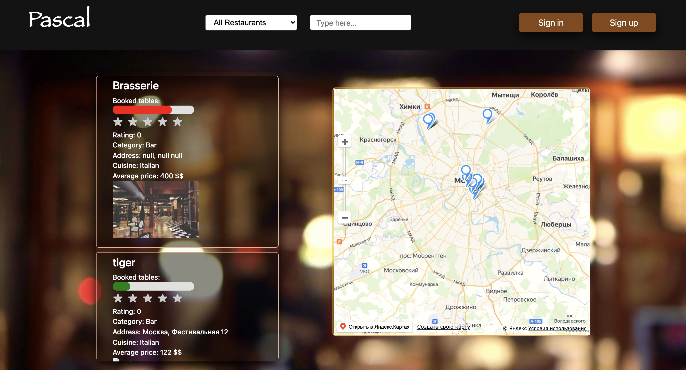
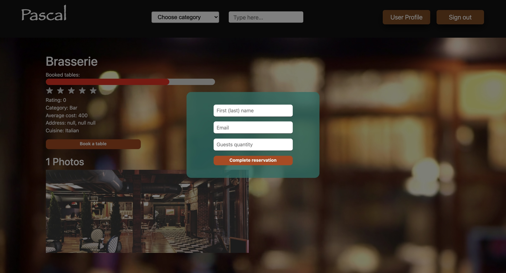
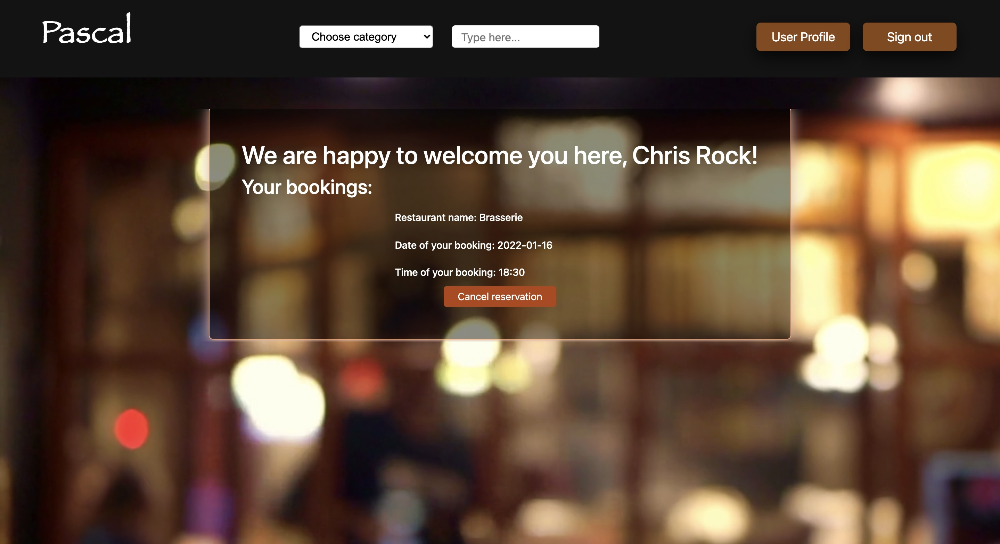

# Pascal

Monitoring the occupancy of nearby places and online table reservations

Веб-сервис для мониторинга загруженности различных заведений (баров, ресторанов, кафе и т.д.). Реализованы: сортировка по категориям, просмотр информации о выбранном месте (рейтинг, средний чек, кухня, адрес, фотографии) и онлайн-бронирование мест.

## Project Screenshots

## Available Scripts

In the project directory, you can run:

### `npm i`

### `npm start`

Run the app in the development mode.\
Open [http://localhost:3000](http://localhost:3000) to view it in your browser

